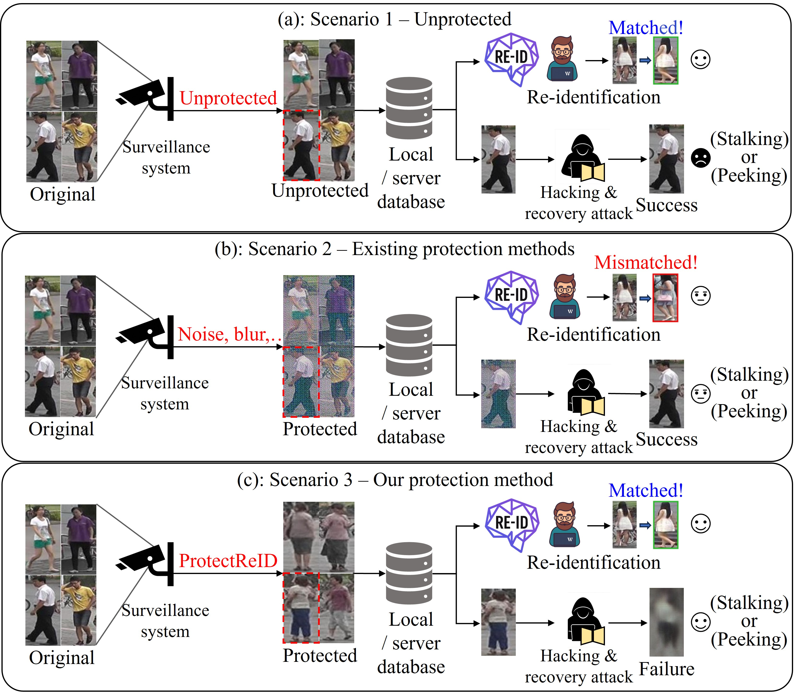

# ProtectReID: Identity Retrieval and Hierarchical Latent Code Protection

This directory is an independent, runnable implementation of:

> Seung-hyeok Back and Seok Bong Yoo, “Privacy-preserving person re-identification through identity retrieval and hierarchical latent code protection.” **Information Sciences, Volume 756, Article 123803, 2026.**

**Publication status:** the paper is **published in Information Sciences (2026)**.  
**DOI:** https://doi.org/10.1016/j.ins.2026.123803


## Overview

ProtectReID is a privacy-preserving person re-identification framework that protects query images while retaining identity-discriminative information for authorized re-ID. The method retrieves identity-aligned and structurally dissimilar latent codes from a fixed gallery, combines the retrieved `W+` representations using reciprocal self-attention and mean pooling, and then performs per-image latent refinement with separate visual and identity objectives.

StyleGAN3, e4e, and the re-ID extractor remain frozen. ProtectReID does not train a separate protector network; only the `14 x 512` `W+` latent code of each input image is optimized during inference.


<p align="center">
  
</p>

<!-- <p align="center">
  <b>Overview of the proposed ProtectReID framework.</b>
</p> -->


<!-- <p align="center">
  
</p> -->

<!-- <p align="center">
  <b>Qualitative results of ProtectReID.</b>
</p> -->


## What is implemented

ProtectReID follows a three-stage protection pipeline:

1. **Identity-aware latent retrieval.** Identity-aligned top-`k` and structurally dissimilar bottom-`k` `W+` codes are retrieved from a fixed Market-1501 gallery.
2. **Hierarchical latent aggregation.** Parameter-free reciprocal self-attention is applied to the top-`k` codes, while the bottom-`k` codes are mean pooled.
3. **Per-image latent refinement.** The resulting `W+` code is refined for each input image using a visual-margin objective on coarse layers and an identity-cosine objective on fine layers.

The reported configuration uses:

| Component | Default |
|---|---:|
| W+ shape | `14 x 512` |
| Retrieval gallery | Market-1501 gallery |
| Retrieval count | `k = 10` |
| Similarity | cosine |
| Attention temperature | `0.1` |
| Coarse layers | `0, 1, 2` |
| Fine layers | `3 ... 13` |
| Refinement iterations | `T = 10` |
| Step size | `alpha = 0.001` |
| Visual margin | `beta = 0.5` |
| Generator noise | `constant` |

The visual objective is:

```text
L_vis = max(0, ||G(f*) - I_b||_2^2 - ||G(f*) - I_o||_2^2 + beta)
```

and is back-propagated only to `W+` layers 0--2.

The identity objective is:

```text
L_id = 1 - cosine(E(G(f*)), E(I_o))
```

and is back-propagated only to `W+` layers 3--13.

Each iteration performs the coarse visual update first, synthesizes the updated latent code, and then performs the fine identity update, following Algorithm 3 of the paper.


## Repository layout

```text
ProtectReID_INS/
├── protectreid/               # Core retrieval, latent aggregation, refinement, and model utilities
├── run.py                     # Gallery construction and protection entry point
├── requirements.txt
└── ...
```


## Environment

Use a CUDA-enabled PyTorch installation compatible with the target GPU.

```bash
git clone <REPOSITORY_URL>
cd ProtectReID_INS

python -m venv .venv
source .venv/bin/activate

python -m pip install --upgrade pip
python -m pip install -r requirements.txt
```

Install the official StyleGAN3 dependencies in the StyleGAN3 checkout as described by NVLabs.

`faiss-cpu` is optional. If FAISS is unavailable, the implementation falls back to exact PyTorch matrix-product search. A CUDA FAISS build can also be used for large galleries.


## Pretrained models

Download or prepare the following assets and pass their paths explicitly to the scripts.

| Asset | Role |
|---|---|
| StyleGAN3 `G_ema` pickle | Synthesizes protected images from `W+` codes |
| e4e checkpoint | Encodes gallery images into `W+` codes during gallery construction |
| Market-1501 ResNet50 re-ID checkpoint | Extracts the 512-D identity feature |
| `Vector_gallery.mat` | Official paired `gallery_f` and `gallery_e4e` arrays |

The StyleGAN3 pickle loader requires a checkout of the official StyleGAN3 implementation, provided through:

```text
--stylegan-root <STYLEGAN_ROOT>
```

The e4e gallery builder requires the corresponding e4e/ProtectReID code root through:

```text
--e4e-root <E4E_ROOT>
```

A prebuilt official MATLAB gallery can be used directly for inference. A generated NPZ gallery additionally stores image stems so exact source exclusion can be applied automatically.


## Data and evaluation protocol

The paper evaluates on the following person re-identification benchmarks:

| Dataset | Images / boxes | Identities | Cameras / notes |
|---|---:|---:|---|
| Market-1501 | 32,668 pedestrian images | 1,501 | six surveillance cameras |
| MSMT17 | 126,441 labeled boxes | 4,101 | 15 cameras, indoor and outdoor |
| CUHK03 | 14,097 detected boxes | 1,467 | cross-view re-ID benchmark |

The reported retrieval gallery is built **only from the 19,732 Market-1501 gallery images**.

For every benchmark:

- only query images are protected;
- trusted evaluation gallery images remain unprotected;
- the Market-1501 retrieval gallery remains fixed for cross-dataset evaluation on MSMT17 and CUHK03.

For authorized matching, use the re-ID model trained on unprotected images and compare protected queries against the unprotected trusted gallery.

The paper reports Rank-1 and mAP with AGW, BagTricks, and ABD-Net. For unauthorized-transfer evaluation, protected queries are evaluated with unseen OSNet, TransReID, and ReIDMamba models.

Visual metrics include PSNR, SSIM, and LPIPS. Lower PSNR/SSIM and higher LPIPS indicate stronger visual distortion.


## Training / offline preparation

ProtectReID does **not** train a protector network.

StyleGAN3, e4e, and the re-ID extractor are frozen off-the-shelf models. The only optimized parameters during protection are the per-image `14 x 512` `W+` values.

The offline preparation stage is construction of the identity-to-latent retrieval gallery.


### Build the identity-to-latent gallery

For faithful main experiments, use the official precomputed `Vector_gallery.mat`.

To build an equivalent NPZ gallery from aligned/cropped Market-1501 gallery images:

```bash
python run.py build-gallery \
  --images <DATA_ROOT>/Market-1501/bounding_box_test \
  --output <STORE_ROOT>/Vector_gallery.npz \
  --reid <MODEL_ROOT>/resnet50_reid.pth \
  --e4e <MODEL_ROOT>/e4e_reid.pt \
  --e4e-root <E4E_ROOT> \
  --device cuda:0
```

Each entry is saved as:

```text
gallery_f    [N, 512]        # Identity feature
gallery_e4e  [N, 14, 512]    # W+ latent code
ids          [N]             # Image filename stems
```

The gallery is an offline artifact. Do not rebuild it from protected images; the paper pairs identity features and latent codes from the original gallery images.


## Inference

Input images should be RGB, aligned/cropped person images. They are resized to the generator's square resolution for synthesis and internally resized to `256 x 128` with ImageNet normalization for the ResNet50 re-ID extractor.

```bash
python run.py protect \
  --input <DATA_ROOT>/query_images \
  --output <OUTPUT_ROOT>/protected_outputs \
  --generator <MODEL_ROOT>/stylegan3_ada_reid.pkl \
  --gallery <STORE_ROOT>/Vector_gallery.mat \
  --reid <MODEL_ROOT>/resnet50_reid.pth \
  --stylegan-root <STYLEGAN_ROOT> \
  --device cuda:0 \
  --k 10 \
  --steps 10 \
  --alpha 0.001 \
  --beta 0.5 \
  --temperature 0.1
```

Outputs are written as:

```text
<OUTPUT_ROOT>/protected_outputs/
├── image_name.png       # Protected image
├── image_name.pt        # Final [14, 512] W+ code
└── metadata.jsonl       # Retrieval indices/scores and source/output paths
```

For generated NPZ galleries, source exclusion is enabled by default and uses the query filename stem.

The official `.mat` gallery does not necessarily contain source IDs. In that case, the pipeline checks for a near-exact identity-feature match and excludes that row if the query itself is present.

For cross-dataset queries, no exact row is found and the full Market-1501 gallery is used.

The implementation processes one query at a time so each query can have its own gallery exclusion and predictable memory usage. Ten refinement iterations require repeated StyleGAN synthesis and are therefore intentionally iterative rather than a single forward pass.

The paper reports approximately **92.87 GFLOPs** and **362.79 ms per image** on its RTX 3080 setup, with the computational cost dominated by latent refinement.


<!--
## Recovery evaluation

The recovery models described in the paper are attacker-side evaluation models, not components of ProtectReID.

To reproduce the recovery experiment:

1. Protect the official training split and save original/protected image pairs.
2. Split those pairs 90/10 into attacker training and validation sets.
3. Train Restormer on protected-to-original pairs using its official configuration.
4. Select the model with the lowest validation reconstruction loss.
5. Run the trained Restormer on the held-out protected test images.
6. Report PSNR, SSIM, LPIPS, and re-ID Rank-1 on recovered images.

The official test split must remain held out from recovery-network training.

The paper also evaluates BIRD and DPIR as off-the-shelf restoration attackers and studies a surrogate retrieval-gallery attacker.


## Reproducibility notes

- All `k` retrieved `W+` codes are retained until reciprocal attention; they are not averaged before attention.
- Bottom-`k` samples are retrieved using the original cosine ranking.
- Exact source-row exclusion is supported when source IDs are available.
- Reciprocal attention uses `QK^T / 512`, not `QK^T / sqrt(512)`.
- The default reciprocal formulation uses no epsilon and no softmax clipping.
- Coarse layers are `0--2`, and fine layers are `3--13`.
- The method performs two sequential gradient updates per refinement iteration, following Algorithm 3.
- StyleGAN3 and the re-ID extractor remain frozen; gradients are applied only to the per-image `W+` tensor.
- Device and checkpoint paths are passed explicitly rather than relying on hard-coded CUDA or local filesystem paths.

Run a syntax check without loading checkpoints:

```bash
python -m compileall -q protectreid run.py
```
-->

## Citation

```bibtex
@article{back2026privacy,
  title={Privacy-preserving person re-identification through identity retrieval and hierarchical latent code protection},
  author={Back, Seung-hyeok and Yoo, Seok Bong},
  journal={Information Sciences},
  pages={123803},
  year={2026},
  publisher={Elsevier}
}
```
